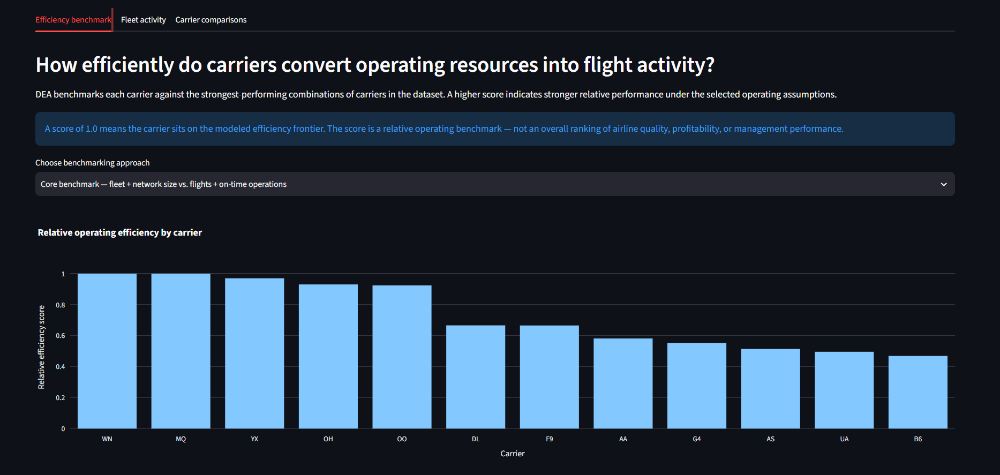
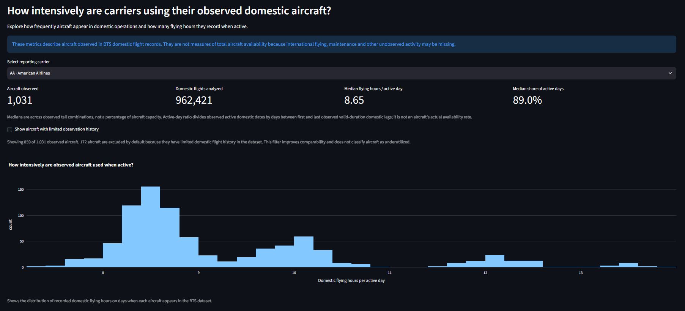
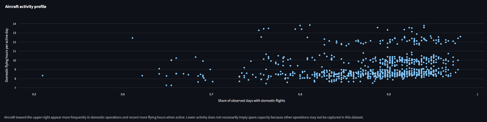
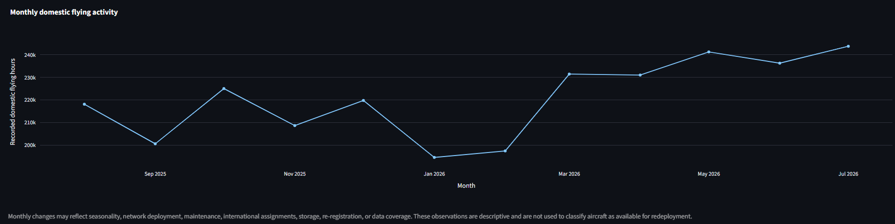
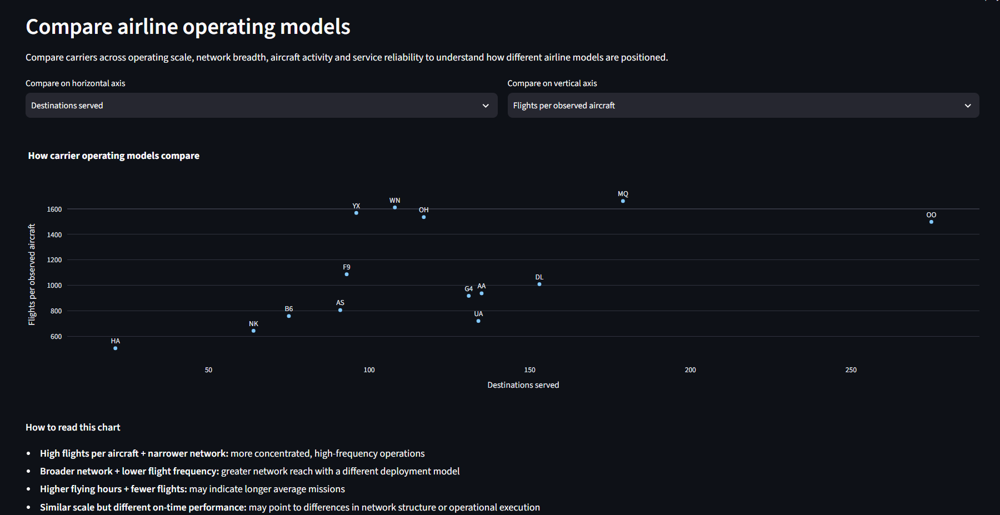

# Airline Operations Intelligence: Efficiency Benchmarking & Fleet Activity Analytics

[](https://github.com/nicholehoyc-sys/airline_operations_intelligence/actions/workflows/tests.yml)

A Python analytics project using **12 months of U.S. domestic airline flight records (August 2025–July 2026)** to benchmark airline operating efficiency with the **Charnes–Cooper–Rhodes (CCR) Data Envelopment Analysis** model.


The project combines carrier-level efficiency benchmarking, aircraft-level activity metrics and sensitivity analysis to examine how different airline operating models turn observed fleet resources into flight activity and service outcomes. An interactive Streamlit dashboard lets users compare carriers, explore aircraft activity patterns, test how sensitive the efficiency results are to different modeling assumptions, and investigate differences in operating performance.



## At a glance

| | |
|---|---|
| Source | U.S. Bureau of Transportation Statistics (BTS), *Reporting Carrier On-Time Performance*: 12 monthly archives |
| Period | 1 Aug 2025 – 31 Jul 2026 (last twelve months to July 2026) |
| Scale | 7,043,858 scheduled flight records · 6,915,477 non-cancelled flights · 14 reporting carriers · 6,390 observed aircraft records (unique carrier-tail pairs) |
| DEA peer set | 12 carriers with 12 active reporting months and ≥10,000 flights (HA and NK are excluded because they have fewer than 12 reporting months) |
| Model | Input-oriented CCR (constant returns to scale), two-stage: radial score, then max-slack; solved with SciPy HiGHS |
| Sensitivity | 4 input/output specifications, shown side by side |

## Key findings (baseline specification)

*Baseline inputs:* observed aircraft and distinct destinations. *Baseline outputs:* non-cancelled flights and on-time arrivals.

- **Southwest (WN) and Envoy (MQ) form the efficient frontier** (score 1.00, zero slack). Every other carrier's reference peers are drawn from these two.
- **Regional carriers score high.** Republic (0.97), PSA (0.93) and SkyWest (0.92) fly short, frequent sectors, so they produce ~1,500–1,660 flights per observed aircraft, compared with ~720–1,010 at the network majors.
- **Network majors score lower under the baseline model** (DL 0.67, AA 0.58, UA 0.50). Because the model counts flights rather than seats or distance, carriers operating longer average missions or larger-capacity aircraft can appear less favorable under a flight-frequency benchmark. The `block_hours_exposure` specification narrows part of this gap (UA 0.50 → 0.68).
- **Results depend on the specification.** Allegiant (G4) scores 0.55 when destinations are an input but 0.999 when network breadth is treated as an output. Its wide, thin network is a cost under one assumption and a product under the other.

These are relative positions within a 12-carrier peer set under stated assumptions. They are not rankings of airline quality or profitability.

| Code | Carrier | Code | Carrier |
|---|---|---|---|
| AA | American Airlines | NK | Spirit Airlines |
| AS | Alaska Airlines | OH | PSA Airlines |
| B6 | JetBlue Airways | OO | SkyWest Airlines |
| DL | Delta Air Lines | UA | United Airlines |
| F9 | Frontier Airlines | WN | Southwest Airlines |
| G4 | Allegiant Air | YX | Republic Airways |
| HA | Hawaiian Airlines | MQ | Envoy Air |

## Dashboard

```bash
python -m pip install -r requirements-dashboard.txt
streamlit run dashboard/app.py
```

The dashboard runs straight away on the checked-in `results/ltm_2026/` snapshot; you don't need to download the ~360 MB of raw archives.

1. **Efficiency benchmark:** efficiency scores under each specification, a cross-specification sensitivity table, and per-carrier slacks (in original units) and reference peers.
2. **Fleet activity:** per-carrier histograms and scatterplots of block hours per active day and active-day ratio for each tail, a aircraft-level table, and monthly domestic flying-hour trends.
3. **Carrier comparisons:** a configurable carrier-level scatter covering scale, network breadth, flights per aircraft, block hours, on-time rate and cancellation rate.

### Fleet activity

The fleet activity view explores how frequently observed aircraft appear in
domestic operations and how much flying time they record when active.



The aircraft-level activity profile compares observation frequency with flying
intensity across individual aircraft.



Monthly trends show how recorded domestic flying activity changes over the
12-month reporting period.





## Architecture

```text
src/airline_dea/
  ltm_pipeline.py       ReportingPeriod, BTSArchiveInventory, BTSMonthlyReader, PeriodAnalyzer:
                        archive checks → chunked CSV reading → carrier / aircraft aggregation → DEA
  dea_model.py          DEAModel / DEAResult: two-stage input-oriented CCR linear programs
  descriptive.py        DescriptiveAnalytics, CoverageCriteria: reconciliation checks and KPIs
  dashboard_service.py  DashboardDataService: loads and cross-checks the snapshot before display
  carriers.py           display names for carrier codes
src/run_ltm.py          regenerate results from the 12 raw archives
src/acquire_bts.py      list or download the official BTS archive URLs
dashboard/app.py        three-tab Streamlit dashboard
tests/                  DEA known solutions, pipeline fixtures, reconciliation, dashboard smoke test
results/ltm_2026/       lightweight results snapshot + provenance.json (SHA-256 of each source archive)
docs/                   METHODOLOGY.md, VALIDATION.md, screenshots
```

Design choices worth noting:
- **Streaming ingestion.** Each month is read in 150k-row chunks, and distinct tails and destinations are kept in sets so they aren't double-counted across months.
- **Fail-closed validation.** A missing month, an out-of-period date, an invalid cancel/divert flag or a missing calendar day aborts the run before any output is written.
- **Provenance.** Every source archive's SHA-256 hash and row count is recorded. The dashboard refuses to load a snapshot whose totals don't reconcile with the manifest.

## Reproduce from raw data

```bash
python -m pip install -r requirements.txt
python src/acquire_bts.py            # or --list-urls, then download manually into data/raw/bts_reporting/
python src/run_ltm.py                # writes output/ltm_2026/; the dashboard prefers it when complete
```

Raw ZIPs (`data/raw/`) and regenerated output (`output/`) are git-ignored.

## Tests

```bash
python -m pip install -e '.[dev,dashboard]'
python -m pytest -q
```

## Limitations

- **Observed tails are not a fleet inventory.** Counts cover tails seen on domestic BTS records. International, charter and ferry flying is not captured, so utilization metrics show *observed domestic activity*, not true aircraft availability.
- **Flights are not capacity.** The model has no seats, ASMs or stage-length control, which favours short-haul and regional operators in flight-count specifications.
- **Small, heterogeneous peer set.** With 12 carriers and 2–3 variables, DEA has limited discrimination, and the frontier depends on who is in the sample.
- **On-time arrivals are a subset of flights,** so the two baseline outputs are correlated.
- **Descriptive only.** The project does not infer causality, forecast, or make aircraft-level recommendations.

See [METHODOLOGY.md](docs/METHODOLOGY.md) for exact definitions and [VALIDATION.md](docs/VALIDATION.md) for reconciliation checks.

## License and attribution

Data: U.S. Bureau of Transportation Statistics, *Reporting Carrier On-Time Performance*. This is an independent portfolio analysis and is not affiliated with BTS or any airline.
